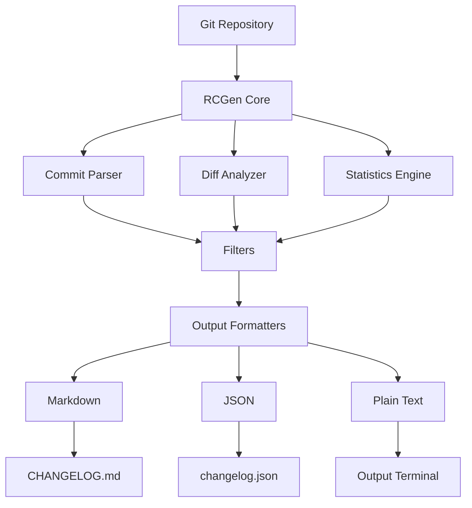

# About RCGen

RCGen (Repository Changelog Generator) is an open-source tool for automatically generating changelogs from Git repositories.

## Philosophy

RCGen is built on the following philosophy:

### 1. **Simple yet Powerful**

- Intuitive command-line interface
- Reasonable defaults for quick deployment
- Flexibility for complex use cases

### 2. **Smart Automation**

- Automatic detection of conventional commits
- Intelligent commit grouping
- Meaningful statistics

### 3. **Easy Integration**

- Multiple output formats (Markdown, JSON, Text)
- CI/CD friendly
- Extensible through configuration

## Architecture



### Main Components

1. **Commit Parser**

- Parsing Git logs
- Extract metadata
- Conventional commit detection

2. **Diff Analyzer**

- Analysis of file changes
- Code line statistics
- Pattern detection

3. **Statistics Engine**

- Contributor analysis
- Bus factor calculation
- Activity timeline

4. **Output Formatters**

- Rendering templates
- Format-specific serialization
- Custom formatting

## Technology

RCGen built with:

- **Rust**: For performance and safety
- **git2**: Binding to libgit2 for Git operations
- **clap**: Command-line argument parsing
- **serde**: Serialization/deserialization
- **toml**: Parsing configuration
- **chrono**: Date/time handling

## Community

### Contributions

RCGen is an open-source project and welcomes contributions. Look:

- [Contributing Guide](../meta/contributing.md)
- [Code of Conduct](../meta/code_of_conduct.md)

### Support

- **Issues**: [GitHub Issues](https://github.com/neuxdotdev/rcgen/issues)
- **Discussions**: [GitHub Discussions](https://github.com/neuxdotdev/rcgen/discussions)

## Team


### Contributors

Thanks to all [contributors](https://github.com/neuxdotdev/rcgen/graphs/contributors) who helped!

## License

RCGen is released under the [AGPL-3.0 license](../meta/license.md).

## Acknowledgements

RCGen is built on the shoulders of giants:

- **Git**: Linus Torvalds and Git contributors
- **libgit2**: The libgit2 team
- **Rust Ecosystem**: The Rust community
- **Conventional Commits**: The conventional commits specification

## Cite RCGen

If you use RCGen in research or publication:

```bibtex
@software{rcgen2024,
title = {RCGen: Git Changelog Generator},
author = {Neux},
year = {2026},
publisher = {GitHub},
url = {https://github.com/neuxdotdev/rcgen},
version = {0.0.1}
}
```

## Contact

- **Email**: neuxdev1@gmail.com
- **GitHub**: [neuxdotdev](https://github.com/neuxdotdev)